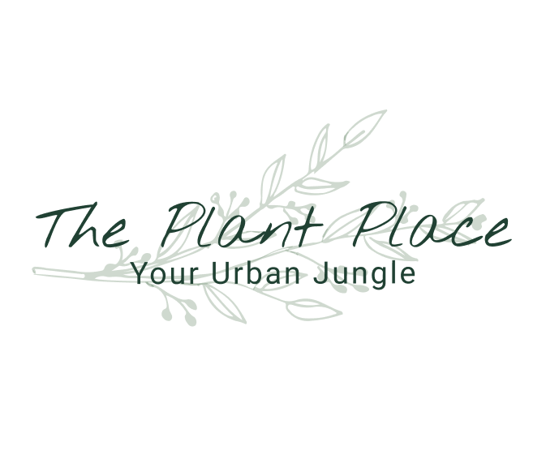

<!-- Repository Information & Links-->
<br />


<!-- HEADER SECTION -->
<h5 align="center" style="padding:0;margin:0;">Bronwyn Potgieter</h5>
<h5 align="center" style="padding:0;margin:0;">200089</h5>
<h6 align="center">DV200 - Term 3 | 2022</h6>
</br>
<p align="center">

  <a href="https://github.com/bee2805/ThePlantPlace">
    
  </a>
  
  <h3 align="center">The Plant Place</h3>

  <p align="center">
    The Plant Place is a mock e-commerse store built using the MERN stack. Since house plants have recenly become super trendy, I decided to create on online store that sells indoor plants that comes with a pot of the clients choice, included in the price.<br>
    
   <br />
   <br />
   <a href="https://drive.google.com/file/d/13yYQyI_oNGEweU1Nftim3kCc0yPdMXoP/view?usp=sharing">View Demo</a>
    ·
    <a href="https://github.com/bee2805/ThePlantPlace/issues">Report Bug</a>
    ·
    <a href="https://github.com/bee2805/ThePlantPlace/issues">Request Feature</a>
</p>
<!-- TABLE OF CONTENTS -->

## Table of Contents

* [About the Project](#about-the-project)
  * [Project Description](#project-description)
  * [Built With](#built-with)
* [Getting Started](#getting-started)
  * [Prerequisites](#prerequisites)
  * [How to install](#how-to-install)
* [Features and Functionality](#features-and-functionality)
* [Concept Process](#concept-process)
   * [Ideation](#ideation)
   * [Wireframes](#wireframes)
* [Development Process](#development-process)
   * [Implementation Process](#implementation-process)
        * [Highlights](#highlights)
        * [Challenges](#challenges)
   * [Future Implementation](#peer-reviews)
* [Final Outcome](#final-outcome)
    * [Mockups](#mockups)
    * [Video Demonstration](#video-demonstration)
* [Conclusion](#conclusion)
* [License](#license)
* [Contact](#contact)
* [Acknowledgements](#acknowledgements)

<!--PROJECT DESCRIPTION-->
## About the Project
<!-- header image of project -->


### Project Description

The Plant Place is an e-commerse store that sells all your favorite house plants! When it comes to affordability, The Plant Place has you covered! With each plant comes a beautiful ceramic pot of your choice included in the price!

### Built With

* [MongoDb](https://www.mongodb.com/cloud/atlas/lp/try4?utm_source=google&utm_campaign=gs_emea_south_africa_search_core_brand_atlas_desktop&utm_term=mongodb%20sign%20in&utm_medium=cpc_paid_search&utm_ad=e&utm_ad_campaign_id=12212624560&adgroup=115749711783&gclid=CjwKCAjwvNaYBhA3EiwACgndgoPwY5WQ5R9Y8UD_MEdENhbITxJjpuwMdeHTzX8FQhjOcoruVejKjBoCNLkQAvD_BwE)
* [Express.js](https://expressjs.com/)
* [React](https://reactjs.org/docs/getting-started.html)
* [Node.js](https://nodejs.org/en/)
* [Axios](https://axios-http.com/docs/intro)

<!-- GETTING STARTED -->
<!-- Make sure to add appropriate information about what prerequesite technologies the user would need and also the steps to install your project on their own mashines -->
## Getting Started

To get a copied file of this repository, follow the steps below to get it installed on your local machine. 

### Prerequisites

Ensure that you have the latest version of [NPM](https://www.npmjs.com/) installed on your machine. The [GitHub Desktop](https://desktop.github.com/) program will also be required.

### How to install

### Installation
Here are a couple of ways to clone this repo:

1. GitHub Desktop </br>
Enter `https://github.com/bee2805/ThePlantPlace.git` into the URL field and press the `Clone` button.

2. Clone Repository </br>
Run the following in the command-line to clone the project:
   ```sh
   git clone https://github.com/bee2805/ThePlantPlace.git
   ```
    Open `Software` and select `File | Open...` from the menu. Select cloned directory and press `Open` button

3. Install Dependencies </br>
Run the following in the command-line to install all the required dependencies:
   ```sh
   npm install / npm i
   ```

5. Ensure that you have a MongoDB database

6. Ensure that Nodemon, Express and Mongo are installed as dependancies   </br>

7. To start the back end run the following in your terminal</br>
   ```sh
   npm run dev 
   ```

<!-- FEATURES AND FUNCTIONALITY-->
<!-- You can add the links to all of your imagery at the bottom of the file as references -->
## Features and Functionality

### See all the newest products and items on sale! 
On the landing page, the user is presented information about the store. New products are presented in a slider and at the bottom of the page, all the sale items are displayed.
<br/>


### Browse Through Products
The product page displays all the products that are available in the store by reading the products from the database and displaying them dynamically on the site.


### Inventory Management
The admin profile will be able to manage the stock available on the e-commerse store. This includes adding, removing and altering information such as price, qty of the product. They will aso be able to put certain products on sale.


### Order Processing
This page showcases incoming orders that are made by the users. The orders include information about the order as well as a dispatch button that removes it from the database.


<!-- CONCEPT PROCESS -->
<!-- Briefly explain your concept ideation process -->
<!-- here you will add things like wireframing, data structure planning, anything that shows your process. You need to include images-->
## Concept Process
### Ideation


<br>

### Wireframes


<!-- DEVELOPMENT PROCESS -->
## Development Process

### Implementation Process
<!-- stipulate all of the functionality you included in the project -->
<!-- This is your time to shine, explain the technical nuances of your project, how did you achieve the final outcome!-->

* Built and styled using HTML and CSS
* Utilised CRUD operations to create, read, update and delete data from the database
* Used MongoDB to store the database
* Utilised Session Storage for signed in users as well as cart items
* Implemented Routing with React-Router
* Implemented useNaviage to ensure that admin profiles are navigated to the admin pages upon sign in.
* Insalled axios on the project with the command "npm i axios"
* Functionality for reading the input values of a form
* Made use props to dynamically input data drom the database
* Made use of useStates and UseEffects

#### Highlights
<!-- stipulated the highlight you experienced with the project -->
* Learning the MERN stack
* Using props to dynamically show the information from the database
* Building and Styling the project

#### Challenges
<!-- stipulated the challenges you faced with the project and why you think you faced it or how you think you'll solve it (if not solved) -->
* Adding more than one item to the cart
* I struggled with clearing the session storage of only one value. I tried sessionStorage(‘productId’).clear() - this said that sessionStorage is not a function. I then tried sessionStorage.clear(‘productId’) - which cleared all session storage. After some reasearch I discovered that .clear() removes everything from the session storage, but I can use .removeItem(‘productId’) to just remove one value.

### Future Implementation
<!-- stipulate functionality and improvements that can be implemented in the future. -->
* Add multiple items to the cart
* Display sale on the individual product page
* The Images on the product page are low quality, in the future I’d like to include more high quality photos
* A counter by the cart to display that users have added items.
* Better styling on admin pages - more specifically on the incoming orders page

<!-- MOCKUPS -->
## Final Outcome

### Mockups


<br>


<br>


<br>


<!-- VIDEO DEMONSTRATION -->
### Video Demonstration

To see a run through of the application, click below:

[View Demonstration](https://drive.google.com/file/d/13yYQyI_oNGEweU1Nftim3kCc0yPdMXoP/view?usp=sharing)


See the [open issues](https://github.com/bee2805/ThePlantPlace/issues) for a list of proposed features (and known issues).

<!-- AUTHORS -->
## Authors

* **Bronwyn Potgieter** - [bee2805](https://github.com/bee2805)

<!-- LICENSE -->
## License

Distributed under the MIT License. See `LICENSE` for more information.\

<!-- LICENSE -->
## Contact

* **Bronwyn Potgieter** - [bronwyn.potgieter@yahoo.co.za](mailto:bronwyn.potgieter@yahoo.co.zas) - [@bronns_designs](https://www.instagram.com/bronns_designs/) 
* **Project Link** - https://github.com/bee2805/ThePlantPlace

<!-- ACKNOWLEDGEMENTS -->
## Acknowledgements
<!-- all resources that you used and Acknowledgements here -->
* [All Product Images](https://unsplash.com/@feeypflanzen)
* [React Slick Documentation](https://react-slick.neostack.com/)
* [3D slider](https://github.com/chrisdesilva/3d-slider)
* [Sale info Image](https://unsplash.com/photos/bBiuSdck8tU)
* [Header Image](https://unsplash.com/photos/W5XTTLpk1-I)
* [Landing Page features Mockup](https://www.creativefabrica.com/product/free-website-mockup/ref/235640/)
* [The rest of the feature Mockups](https://www.mockupworld.co/free/website-presentation-showcase-mockup/)
*