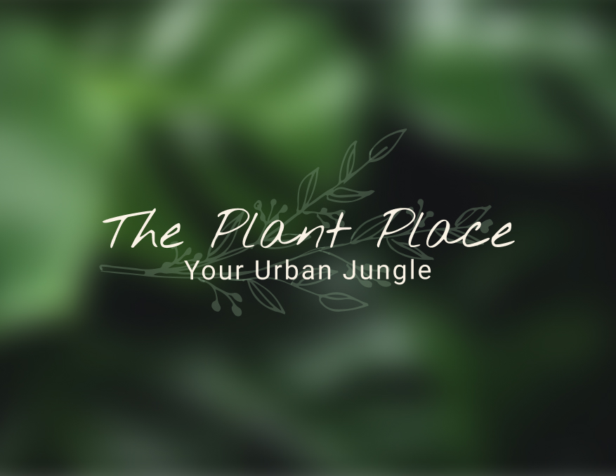

<!-- Repository Information & Links-->
<br />


<!-- HEADER SECTION -->
<h5 align="center" style="padding:0;margin:0;">Bronwyn Potgieter</h5>
<h5 align="center" style="padding:0;margin:0;">200089</h5>
<h6 align="center">DV200 - Term 3 | 2022</h6>
</br>
<p align="center">

  <a href="https://github.com/bee2805/ThePlantPlace">
    
  </a>
  
  <h3 align="center">OK Boomer</h3>

  <p align="center">
    In light of the quiz craze that arose during the Covid19 Pandemic, I decided to create a trivia app that would bring together individuals from different backgrounds.  The OK Boomer mobile game was designed and built using Kotlin and Android Studio. This App was inspired by the OK Boomer Card Game.<br>
    
   <br />
   <br />
   <a href="https://drive.google.com/file/d/13yYQyI_oNGEweU1Nftim3kCc0yPdMXoP/view?usp=sharing">View Demo</a>
    ·
    <a href="https://github.com/bee2805/ThePlantPlace/issues">Report Bug</a>
    ·
    <a href="https://github.com/bee2805/ThePlantPlace/issues">Request Feature</a>
</p>
<!-- TABLE OF CONTENTS -->

## Table of Contents

* [About the Project](#about-the-project)
  * [Project Description](#project-description)
  * [Built With](#built-with)
* [Getting Started](#getting-started)
  * [Prerequisites](#prerequisites)
  * [How to install](#how-to-install)
* [Features and Functionality](#features-and-functionality)
* [Concept Process](#concept-process)
   * [Ideation](#ideation)
   * [Wireframes](#wireframes)
   * [Custom UI](#user-flow)
* [Development Process](#development-process)
   * [Implementation Process](#implementation-process)
        * [Highlights](#highlights)
        * [Challenges](#challenges)
   * [Future Implementation](#peer-reviews)
* [Final Outcome](#final-outcome)
    * [Mockups](#mockups)
    * [Video Demonstration](#video-demonstration)
* [Conclusion](#conclusion)
* [License](#license)
* [Contact](#contact)
* [Acknowledgements](#acknowledgements)

<!--PROJECT DESCRIPTION-->
## About the Project
<!-- header image of project -->


### Project Description

Welcome to the OK Boomer mobile trivia application! It is no secret that each generation thinks they’re better than the next, so, this game was designed to put that to the test!

### Built With

* [Android Studio](https://developer.android.com/studio?gclid=CjwKCAjw3qGYBhBSEiwAcnTRLudtJ2FIlpZp7wRlpahXN_ZNMtz229FDIOG7RtDaLKjgrbFTDy7y5hoCzcYQAvD_BwE&gclsrc=aw.ds)
* [Kotlin](https://kotlinlang.org/)
* XML

<!-- GETTING STARTED -->
<!-- Make sure to add appropriate information about what prerequesite technologies the user would need and also the steps to install your project on their own mashines -->
## Getting Started

The following instructions will get you a copy of the project up and running on your local machine for development and testing purposes.

### How to install

### Prerequisites
Ensure that you have GitHub desktop and Android Studio downloaded onto your machine.

### Installation
Here are a couple of ways to clone this repo:

1. GitHub Desktop </br>
Enter `https://github.com/bee2805/ThePlantPlace.git` into the URL field and press the `Clone` button.

2. Clone Repository </br>
Run the following in the command-line to clone the project:
   ```sh
   git clone https://github.com/bee2805/ThePlantPlace.git
   ```
    Open `Software` and select `File | Open...` from the menu. Select cloned directory and press `Open` button


<!-- FEATURES AND FUNCTIONALITY-->
<!-- You can add the links to all of your imagery at the bottom of the file as references -->
## Features and Functionality

### Splash Screen

I implemented a splash screen that displays as soon as the application is opened by the user. It is active for 3 and thereafter the user will be directed to the home page where they will need to add their username.


### Categories

The user can choose between different categories that they would like to play.


### Questions

There are three different views for each question type. Two of the question types have three options in which you can pick and the lyric-based question view allows users to answer by typing in the answer. As the user plays each category, points will accumulate for each correct answer.


### Results/Scores

The result screen displays after a user have completed a category. The score from the specific Category played is displayed here.


<!-- CONCEPT PROCESS -->
<!-- Briefly explain your concept ideation process -->
<!-- here you will add things like wireframing, data structure planning, anything that shows your process. You need to include images-->
## Concept Process

* I thought about the goals that I wanted to achieve with this app. The main goal was definitely to create an app that brings people together, so I jotted down a few ideas that could achieve this goal. The first ideas I got were either not exciting enough, or they were interest-specific. 
* After bashing ideas around my brain, I finally conclude that a generation quiz would not only be super fun and inclusive, but would also bring on that nostalgia feeling, and I think we can all admit that it’s a great feeling to have!
* I then decided on the categories that I wanted to include and after some amazing advice, I added an extra category that tells you which generation your soul belongs to!

After setting this up, I went ahead and did some research on different trivia games or apps to get a bit of inspiration for the brand and layout of the app. It was then that I ran into this amazing card game called OK boomer on Behance. After completely falling in love with this whole idea as well as the branding, I mean, how could you not?!!! I got inspired and decided to base my app on this card game.

### Ideation


<br>

### Wireframes


<!-- DEVELOPMENT PROCESS -->
## Development Process

### Implementation Process
<!-- stipulate all of the functionality you included in the project -->
<!-- This is your time to shine, explain the technical nuances of your project, how did you achieve the final outcome!-->

* Validation of inputs
* XML for the layout and styling
* Kotlin for the functionality
* Different questions are dynamically displayed

#### Highlights
<!-- stipulated the highlight you experienced with the project -->
* It was super exciting to learn Kotlin and build my very first android app!
* Ater getting my muse, which was OK Boomer, the excitement grew each day. I had a lot of fun doing the research, especially for the lyric-based questions. 
* I had a lot of fun doing the research, especially for the lyric-based questions. 

#### Challenges
<!-- stipulated the challenges you faced with the project and why you think you faced it or how you think you'll solve it (if not solved) -->
* Because of the way I set up my questions, I had challenges when trying to navigate to the next question activity in a specific genre.
* I struggled to set the session storage for the scores from each category from the results activity.


#### Above And Beyond

* I implemented different ways in which a question can be answered - Either a text input with appropriate validation or selecting between three answers.
* 8 questions per category instead of 5
* 5 categories instead of 3

### Future Implementation
<!-- stipulate functionality and improvements that can be implemented in the future. -->

* I'd like to implement the high scores from each category.
* Visual communication when the incorrect or correct answer is chosen
* A light and dark mode toggle in the settings menu

<!-- MOCKUPS -->
## Final Outcome

### Mockups


<br>


<br>


<br>


<!-- VIDEO DEMONSTRATION -->
### Video Demonstration

To see a run through of the application, click below:

[View Demonstration](https://drive.google.com/file/d/13yYQyI_oNGEweU1Nftim3kCc0yPdMXoP/view?usp=sharing)


See the [open issues](https://github.com/bee2805/ThePlantPlace/issues) for a list of proposed features (and known issues).

<!-- AUTHORS -->
## Authors

* **Bronwyn Potgieter** - [bee2805](https://github.com/bee2805)

<!-- LICENSE -->
## License

Distributed under the MIT License. See `LICENSE` for more information.\

<!-- LICENSE -->
## Contact

* **Bronwyn Potgieter** - [bronwyn.potgieter@yahoo.co.za](mailto:bronwyn.potgieter@yahoo.co.zas) - [@bronns_designs](https://www.instagram.com/bronns_designs/) 
* **Project Link** - https://github.com/bee2805/ThePlantPlace

<!-- ACKNOWLEDGEMENTS -->
## Acknowledgements
<!-- all resources that you used and Acknowledgements here -->
* [OK Boomer Website](https://okboomer.game/)
* [OK Boomer Instagram](https://www.instagram.com/okboomer.game/)
* [OK Boomer Behance Project](https://www.behance.net/gallery/145988733/Ok-Boomer-Branding-and-Design-for-Trivia-Game)
* [Boomer Questions and imagery Source 1](https://www.buzzfeed.com/briangalindo/quiz-that-is-easy-for-baby-boomers-only)
* [Boomer Questions and imagery Source 2](https://www.buzzfeed.com/sarahaspler/boomer-trivia-quiz)
* [Gen X Questions](https://www.buzzfeed.com/briangalindo/only-gen-xers-are-passing-this-quiz)
* [Millennial Questions](https://www.buzzfeed.com/briangalindo/easy-2000s-trivia-quiz-for-millennials)
* [Gen Z Questions](https://www.buzzfeed.com/farrahpenn/these-trivia-questions-will-separate-gen-z-cuspers-from)
* [Mockups](https://www.behance.net/gallery/112977919/Google-Pixel-5-Mockup-Free-Download)
* All the links to specific imagery is displayed in the code